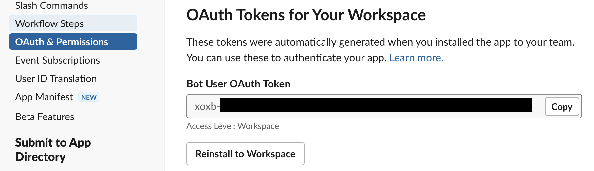
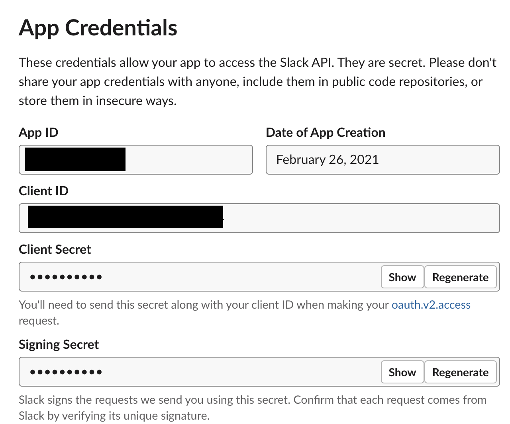
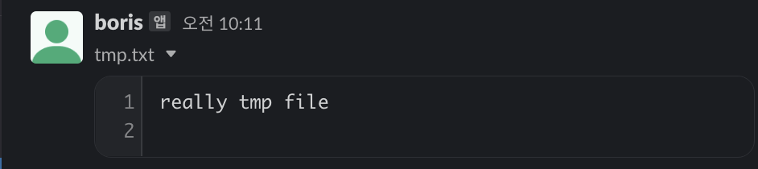
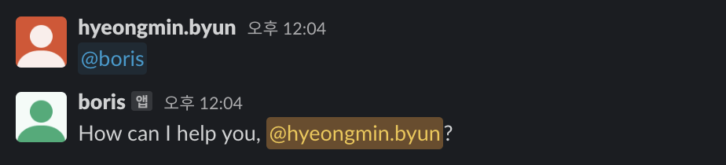
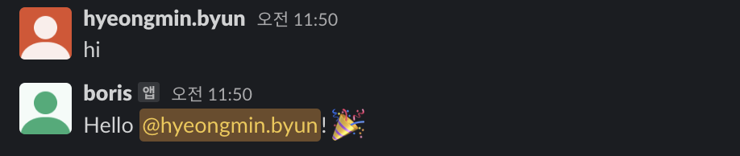
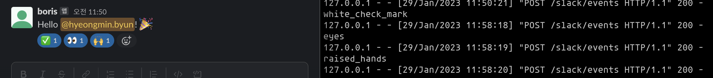

# Hello, slackbot!

## requirements
- Python 3.9
- `pip install requirements.txt`

## Adding new app to the Slack workspace
- visit [https://api.slack.com/apps](https://api.slack.com/apps)
- follow the process

- set configs appropriately:
  - `SLACK_BOT_USER_OAUTH_TOKEN` from `Bot User OAuth Token` from `Features: OAuth & Permissions > OAuth Tokens for Your Workspace`

  - 

  - `SLACK_APP_ID` from `Settings: Basic Information > App Credentials > App ID`
  - `SLACK_CLIENT_ID` from `App Credentials > Client ID`
  - `SLACK_CLIENT_SECRET` from `App Credentials > Client Secret`
  - `SLACK_SIGNING_SECRET` from `App Credentials > Signing Secret`

  - 

## How to run
- `python async_write.py`
  - 
  - simply writing a text to certain channel
  - requires `chat:write`

- `python upload.py`
  - 
  - uploads a file specified by `--filepath` to slack, defaults to `./tmp.txt`
  - requires `files:write` / also requires `files.read` permission to check uploaded content

- `python event.py`
  - `ngrok http 8000 --oauth google`
  - visit slack api's `Features > Event Subscriptions` tab and enter url provided by ngrok
  - solve ["challenge"](https://api.slack.com/events/url_verification) by temporarily uncommenting `@app.route("/slack/events")` code block
    - definitely we need a better way, but since it is one-time job...
  - `Subscribe to bot events`
    - `app_mention`
      - 
    - `message.channels`
      - 
    - `reaction_added`
      - 
  - Monitor incoming events from `http://localhost:4040`

## To Refer
- https://slack.dev/python-slack-sdk/api-docs/slack_sdk/
- https://api.slack.com/methods
- https://github.com/slackapi/python-slack-events-api
